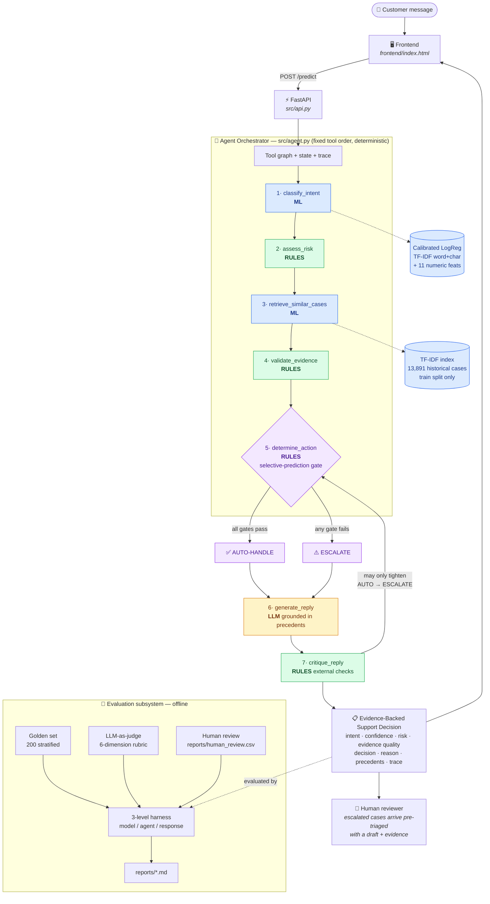
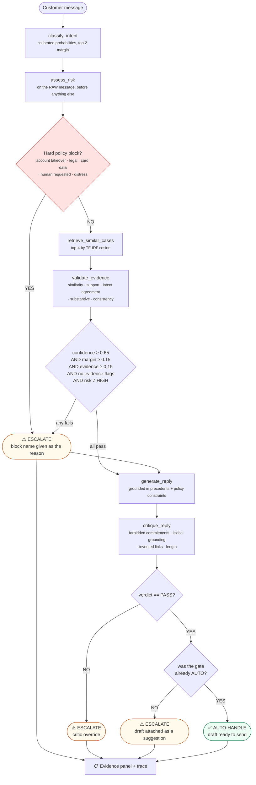

# AI Customer Support Agent

**Evidence-backed, confidence-aware customer support automation for `@SpotifyCares`.**

A hybrid agentic system built on the [Customer Support on Twitter](https://www.kaggle.com/datasets/thoughtvector/customer-support-on-twitter)
dataset. It classifies an incoming customer message, retrieves how the brand
actually resolved similar cases, drafts a reply grounded in those precedents, and
decides whether to **auto-handle** or **escalate to a human** — with a stated
reason and the evidence attached.

> The design bias is **trust over autonomy**. The LLM writes prose inside a box
> that deterministic code defines. It cannot change a decision, lower a risk
> level, or bypass a policy block.

📊 [Report](reports/report.md) · 🔬 [Research & gap analysis](reports/research.md) · 📋 [Decision log](reports/decision_log.md) · 📈 [Evaluation](reports/evaluation.md) · 🎬 [Demo script](DEMO.md)

---

## Problem statement

Brands answer customer complaints publicly on Twitter. Volume is high, language is
noisy, and the cost of a wrong answer is asymmetric: a *public* wrong answer is
quotable and attached to the brand forever, while a message routed to a human
costs a few minutes of agent time.

So the objective is **not** "answer as many tweets as possible". It is:

> Answer the messages we can answer **with evidence**, hand over everything else
> **with a reason**, and let a human verify either judgement in ten seconds.

This is a triage problem with a drafting assistant attached — not a chatbot.

---

## Key features

| | |
|---|---|
| **Evidence-backed decisions** | Every decision ships with the precedents it was based on, their similarity scores, and a five-signal evidence-quality breakdown |
| **Selective prediction** | Escalation is modelled as abstention; thresholds come from a risk-coverage sweep on validation, not from judgement |
| **Deterministic policy** | Risk levels, hard blocks and forbidden commitments are unit-tested Python — an LLM cannot argue its way past them |
| **Grounded drafting** | The generator sees only the message, intent and precedents; a deterministic critic then checks the draft against that evidence |
| **Graceful degradation** | With no LLM key the system still runs end-to-end using extractive replies, clearly labelled |
| **Leakage-guarded** | Conversation-level grouping in four places, enforced by tests |
| **Full auditability** | Every response carries a 7-step tool trace |

---

## Architecture



🟦 ML · 🟩 deterministic rules · 🟨 LLM · 🟪 decision points.
The colouring is the point: **the LLM touches exactly one box**, and it is not the
one that decides anything.

---

## Agentic decision workflow



Two properties this diagram encodes, both true of the code:

1. **A reply is drafted on both branches.** Escalated cases reach the human
   pre-triaged with a draft and its evidence — assist the agent, don't replace them.
2. **The critic can only tighten.** `AUTO-HANDLE → ESCALATE` is reachable;
   `ESCALATE → AUTO-HANDLE` is not.

---

## Why hybrid agentic?

| Layer | Owns | Cannot do |
|---|---|---|
| **Agent** | tool order, state, error handling, final decision | — |
| **ML** | intent probabilities, calibration, similarity retrieval | set policy |
| **Rules** | risk levels, hard blocks, thresholds, forbidden commitments | be overridden by the LLM |
| **LLM** | reply wording, advisory critique | change the decision or bypass a block |

**Why not let the LLM plan?** τ-bench (Yao et al., 2024) measured frontier
function-calling agents on exactly this task shape: under 50% success and
`pass^8 < 25%` on retail support — the same case handled correctly once is often
handled wrongly on retry. A support system whose central promise is "you can trust
the hand-off" cannot have a non-deterministic hand-off. Every case also needs the
same four facts before a decision is possible, so there is nothing for a planner
to decide.

**Why not let the LLM self-check?** Huang et al. (ICLR 2024) showed intrinsic
self-correction is unreliable without external feedback. So every verdict-changing
check in the critic is external and deterministic.

**Why not a prompt-only system?** A prompt constraint is a suggestion; a regex is
a control. And nothing would be measurable per-component — a bad reply could come
from misclassification, bad retrieval or bad drafting, with no way to tell which.

---

## Component reference

**1 · Frontend** (`frontend/index.html`) — Single-page app, zero build step, served
by the API itself. Renders the full decision chain: what was asked, what the AI
understood, what evidence it found, how confident it is, why it auto-handled or
escalated, and what it would reply. Every field comes from the live API; nothing
is hard-coded.

**2 · API** (`src/api.py`) — FastAPI. `GET /` (frontend), `POST /predict`,
`GET /health`, `GET /intents`, `GET /demo_cases`. Serving the UI same-origin means
no CORS setup and one process to start during a demo.

**3 · Agent Orchestrator** (`src/agent.py`) — Runs seven tools in fixed order,
maintains state, handles tool failure, and makes the final decision. Deterministic
by design (see above). Appends every step to `state["trace"]` so any decision can
be replayed.

**4 · Intent Classifier** (`src/train.py`, `src/feature_engineering.py`) —
Multinomial logistic regression over TF-IDF word 1–2 grams + char_wb 3–4 grams
(noisy Twitter spelling) + 11 numeric features (counts, uppercase ratio, digit
ratio, URL/mention/hashtag, lexicon sentiment). `StandardScaler` on the dense
numeric block only — standardising sparse TF-IDF would densify a 20k × 200k matrix
for no gain. Chosen over LinearSVC because the decision layer needs probabilities.

**5 · Historical Retrieval** (`src/retrieval.py`) — TF-IDF cosine over 13,891
training customer messages, returning the brand's actual replies with similarity
and provenance. **Training rows only** — indexing test rows would let a message
retrieve itself at similarity 1.0.

**6 · Evidence Validation** (`src/evidence.py`) — Weighted score over five signals:
top similarity (0.35), supporting-case count (0.20), intent agreement with
precedents (0.20), substantive-vs-boilerplate share (0.15), consistency between
retrieved replies (0.10). Raises flags (`weak_similarity`, `conflicting_precedent`,
`precedent_is_boilerplate_only`, `low_information_message`, …) that gate the
decision. Adapted from RAGAS context-relevance, used as a *pre-generation gate*
rather than a post-hoc metric.

**7 · Risk / Confidence Engine** (`src/risk_engine.py`, `src/calibration.py`) —
Risk level per intent plus hard blocks matched on the raw message. Auto-handle
requires *all* gates to pass. Thresholds come from a (confidence × evidence)
risk-coverage sweep on validation, published in `reports/risk_coverage_sweep.csv`.

**8 · Response Generator** (`src/response_generation.py`) — The LLM sees only the
message, intent, precedents and policy constraints — no other source from which to
invent a policy. Returns structured JSON including which precedents it used.
Without a key, an extractive fallback reuses the brand's closest precedent verbatim.

**9 · Human Escalation** — Any failed gate, hard block, or critic rejection.
Escalated cases arrive with the draft, the evidence, and the written reason.

**10 · Evaluation System** (`src/evaluation.py`, `src/judge.py`) — Three levels
kept separate: model quality, agent quality (was the *decision* right?), response
quality. Collapsing them hides the failure you care about.

---

## Dataset and brand selection

2.81M tweets → scored the ten highest-volume brands → **`SpotifyCares`**.

| brand | answered pairs | boilerplate replies | median reply chars | English share |
|---|---|---|---|---|
| AmazonHelp | 168,814 | 0.6% | 120 | 0.926 |
| AppleSupport | 106,646 | **38.9%** | 129 | 0.969 |
| **SpotifyCares** | **43,092** | **25.7%** | **131** | **0.983** |
| TMobileHelp | 34,215 | 60.6% | 126 | 0.987 |

Volume is the wrong criterion: the system grounds replies in historical
resolutions, so what matters is whether replies *contain* a resolution. Amazon has
4× the data but is heavily multilingual; Apple sends 39% pure "DM us" hand-offs.
Spotify balances volume, English purity and substantive replies
(*"tap the three dots > View Album"*), and has a genuine high-risk subset that
makes the escalation policy meaningful.

**Sampling**: 43,092 pairs → 20,000 modelled across 13,637 conversations, sampled
**by whole conversation**, `seed=42`.

| step | rows |
|---|---|
| raw answered pairs | 43,092 |
| dropped: length outside 15–1200 chars | 791 |
| dropped: duplicate messages | 1,964 |
| dropped: non-English | 145 |
| **final** | **20,000** (train 13,891 / val 3,033 / test 3,076) |

**Leakage control** — `conversation_id` (root of each reply chain) groups: the
train/val/test split, the `GroupKFold` inside hyperparameter search, the
calibration/threshold halves, and the retrieval index. All four enforced by tests.

---

## Intent taxonomy

Nine intents derived from the brand's own traffic. Labels via weak supervision
(Snorkel-style labelling functions).

| intent | risk | share |
|---|---|---|
| `general_complaint_feedback` | LOW | 72.2% |
| `subscription_plan` | MEDIUM | 8.5% |
| `app_device_bug` | MEDIUM | 4.3% |
| `feature_how_to` | LOW | 3.6% |
| `content_availability` | LOW | 3.2% |
| `account_login_access` | **HIGH** | 3.1% |
| `playback_streaming_issue` | MEDIUM | 2.1% |
| `billing_payment` | **HIGH** | 1.8% |
| `cancellation_request` | **HIGH** | 1.2% |

The 72% catch-all is the most important fact about this dataset. An earlier
taxonomy put 79% there; inspecting the bucket revealed real rule-coverage gaps, and
broadening the labelling functions brought it to 72.2%. The residual is largely
genuine — **50.5% of messages trip no rule at all**, because many tweets in a
thread are context-dependent follow-ups with no standalone intent.

---

## Results

### Intent classification (test, 3,076 rows, weak-supervision labels)

| model | accuracy | macro F1 | weighted F1 |
|---|---|---|---|
| Baseline 1 — majority class | 0.720 | **0.093** | 0.603 |
| Baseline 2 — TF-IDF unigram + LogReg | 0.813 | 0.544 | 0.790 |
| Baseline 3 — TF-IDF + ComplementNB | 0.786 | 0.528 | 0.767 |
| Ablation — word TF-IDF only | 0.841 | **0.721** | 0.847 |
| **Tuned full model (shipped)** | **0.842** | **0.711** | **0.848** |

macro F1 **0.544 → 0.711 (+31%)** over the simple baseline. Best CV macro F1
0.7183 from 12 configs × 3-fold `GroupKFold` (36 fits, 110s).

**An honest result I am not hiding:** the ablation *beats* the shipped model on
macro F1. The char n-grams and numeric features did not earn their place. The
shipped model is the grid-search winner selected without touching test, but a
cleaner experiment would have put the feature-block toggle *inside* the CV grid.

### Agent behaviour (golden set, 200 stratified examples)

| metric | value |
|---|---|
| coverage (auto-handled) | 38.5% |
| selective accuracy on auto-handled | 83.1% |
| error rate on auto-handled | 16.9% |
| accuracy on escalated slice | 79.7% |
| accuracy overall | 81.0% |

On the *test* split (closer to production mix) coverage is **46.7%**. The golden
set deliberately over-samples hard cases, so its coverage is lower by design.

### Calibration

ECE **0.0290 → 0.0290**. Platt scaling changed nothing — reported as a negative
result. A regularised linear model was already near-calibrated, a different regime
from the deep networks Guo et al. studied. The check was run rather than assumed.

### Retrieval

**Not formally measured** — there is no relevance-labelled retrieval set. Observed
qualitatively in the human review (3/10 rated "good", see below) and visible per
request via similarity scores.

### LLM-as-judge

Rubric implemented across 6 dimensions with a separate judge model. The bulk
evaluation in `reports/evaluation.md` ran on the **heuristic** backend for
determinism and speed; the LLM path is exercised live in the demo. Judge–human
agreement: **not implemented** — harness ready (`src/human_agreement.py`), requires
human ratings.

---

## Human review

10 real messages, run through the live HTTP API, inspected end-to-end.
Full detail: [`reports/human_review.csv`](reports/human_review.csv).

> ⚠️ **Reviewer was an AI assistant acting as a support reviewer**
> (`reviewer=ai_simulated`), not a human annotator. The outputs reviewed are real;
> the review itself is not independent evidence of quality and is not a substitute
> for the pending human labelling of the golden set.

| dimension | result |
|---|---|
| decision correct | **9 / 10** |
| intent correct (unambiguous yes) | 4 / 10 |
| retrieval good | 3 / 10 |
| evidence sufficient | 3 / 10 |
| no hallucination | 8 / 10 |
| mean reply quality | 3.2 / 5 |

**The finding that matters:** decision quality (9/10) is far higher than intent
quality (4/10). The gate is doing real work — it escalates cases where the
classifier is wrong or unsure, so classifier errors mostly become escalations
rather than wrong public replies. That is the architecture's central claim, and
this is the first direct evidence for it.

**Two defects found and fixed** (see below); **one logged and not fixed**: a draft
once claimed *"We've just sent a DM your way"* — an action the system never
performed. The forbidden-commitment regexes do not yet cover claimed-action-by-us
phrasing.

---

## Failure analysis

| # | mode | example | why |
|---|---|---|---|
| 1 | **Context-free follow-up** | *"Ok, 2018 Skoda Kodiaq, Columbus Big Navi, CarPlay"* | No standalone intent; it lives in the previous turn. 65% of errors. |
| 2 | **Label wrong, model right** | *"I deleted my Facebook account and can no longer login"* → rule says catch-all, model says `account_login_access` | The weak label is wrong; the model is penalised for being right |
| 3 | **Overlapping intents** | *"PREMIUM TRIAL … I want to cancel"* | Genuinely both `subscription_plan` and `cancellation_request` — escalated correctly |
| 4 | **Low-confidence confusion** | *"premium acc… how do I play all tracks?"* | Two topics in one tweet — escalated correctly |
| 5 | **Boilerplate-only precedent** | *"charged me twice, please refund"* | Classification fine; retrieval returns only "DM us" replies → flagged, escalated |

Modes 3–5 are the system **working**. Mode 1 is the real defect. Mode 2 is a
labelling defect.

---

## What is misleading about the headline number

**84.2% accuracy / 0.711 macro F1** is softer than it looks:

1. **Labels are rules, so the model is partly graded by its own teacher.** The biggest caveat. The golden set exists to break this loop — and must be human-reviewed before its number means anything.
2. **A 72% catch-all class inflates accuracy directly.** Predicting it for everything scores 72%.
3. **The escalation gate is graded against those same weak labels.** "90% selective accuracy" means 90% agreement with rules.
4. **The golden set is deliberately harder than production traffic**, so its score is a conservative floor.
5. **Classification accuracy says nothing about reply quality.**
6. **Single-turn framing mismatches the data** — 50.5% of messages trip no rule.
7. **A concrete example from this build:** the `low_information_message` guard *reduced* weak-label selective accuracy (85.9% → 83.1%) while removing a class of confidently-wrong auto-replies. The metric and the right product decision disagreed. Only human labels can settle that.

**The number I would defend:** *of the messages the agent chose to answer alone,
83.1% had the right intent* — with everything else routed to a human with a written
reason. And even that carries caveat 1.

---

## How to run

Verified end-to-end. Full pipeline ≈ 6 minutes, excluding the dataset download.

```bash
pip install -r requirements.txt
```

**Get the data** — place `twcs.csv` at `data/raw/twcs.csv`. From
[Kaggle](https://www.kaggle.com/datasets/thoughtvector/customer-support-on-twitter),
or the byte-identical mirror if you have no Kaggle account:

```bash
python -c "import urllib.request; urllib.request.urlretrieve('https://huggingface.co/datasets/SunidhiSriram/twcs/resolve/main/twcs.csv','data/raw/twcs.csv')"
```

**Optional** — `cp .env.example .env` and add an OpenAI-compatible key
(NVIDIA NIM's free tier works). **Everything runs without one**: replies become
extractive and the judge runs a deterministic rubric, both clearly labelled.

```bash
python -m src.data_processing    # ~90s  brand scoring, pairs, cleaning, grouped splits
python -m src.train              # ~150s 3 baselines + 36-fit GroupKFold grid search
python -m src.retrieval          # ~5s   build the historical case index
python -m src.calibration        # ~60s  ECE + risk-coverage threshold sweep
python -m src.build_golden_set   # ~10s  200 stratified evaluation examples
python -m src.evaluation         # ~90s  all three evaluation levels
pytest -q                        # 24 tests, incl. 3 leakage guards
```

**Run the app** — one process serves both API and UI:

```bash
uvicorn src.api:app --port 8000
```

Open <http://localhost:8000>. See [DEMO.md](DEMO.md) for a 3–5 minute walkthrough.

### API

| endpoint | purpose |
|---|---|
| `GET /` | frontend |
| `POST /predict` | `{"message": "..."}` → full evidence-backed decision |
| `GET /health` | status, indexed cases, active backends, thresholds |
| `GET /intents` | the taxonomy |
| `GET /demo_cases` | real demo messages for the UI chips |

```bash
curl -X POST localhost:8000/predict -H "Content-Type: application/json" \
     -d '{"message":"@SpotifyCares I was charged twice for premium, please refund"}'
```

### The two manual steps

Neither can be automated, and both are honestly marked incomplete:

```bash
python -m src.review_golden_set        # ~15 min — required before the golden number means anything
python -m src.human_agreement --rate   # ~10 min — rate 25 replies blind, then compute agreement
```

---

## Repository structure

```
frontend/index.html        single-page UI, no build step
src/
  config.py                paths, seed, thresholds, LLM settings
  text_utils.py            shared normalisation (training AND serving)
  intents.py               9-intent taxonomy + weak-supervision labelling functions
  data_processing.py       brand scoring, pair building, cleaning, grouped splits, EDA
  feature_engineering.py   TF-IDF (word+char) + 11 numeric features, correct scaling
  train.py                 baselines, GroupKFold grid search, self-verifying artefacts
  calibration.py           ECE + Platt scaling + risk-coverage threshold sweep
  retrieval.py             TF-IDF historical case index (training rows only)
  evidence.py              5-signal evidence-quality score       [validate_evidence]
  risk_engine.py           risk levels, hard blocks, forbidden commitments [assess_risk]
  response_generation.py   grounded LLM draft + extractive fallback [generate_reply]
  critic.py                deterministic external checks          [critique_reply]
  agent.py                 orchestrator: tool graph, state, decision
  judge.py                 LLM-as-judge rubric + heuristic fallback
  evaluation.py            3-level harness + failure analysis
  build_golden_set.py      stratified 200-example sampler
  review_golden_set.py     human review CLI
  human_agreement.py       blind rating protocol + agreement statistics
  build_human_review.py    structured review of live agent output
  api.py                   FastAPI (serves UI + endpoints)
reports/                   report, research, decision log, EDA, evaluation, human review
data/golden_set/           golden_set.csv
tests/                     24 tests, incl. conversation-leakage guards
demo_cases.json            6 real dataset messages for the demo
```

---

## Implementation status

| Deliverable | Status |
|---|---|
| Runnable repo, <15 min | ✅ ~6 min |
| Frontend | ✅ served at `/`, all fields live from the API |
| Intent classification, 3 baselines, real HPO | ✅ 36-fit GroupKFold search |
| Retrieval + grounded replies | ✅ both backends verified live |
| Auto-handle / escalate + reason | ✅ thresholds empirically tuned |
| Golden set 150–250 | ⚠️ 200 built · **0 human-reviewed** |
| Automated metrics | ✅ 3 levels |
| LLM-as-judge | ⚠️ implemented; bulk run used the heuristic backend |
| Judge–human agreement | ❌ **not implemented** — needs human ratings |
| Human review | ✅ 10 cases, ⚠️ AI-simulated reviewer |
| Failure analysis | ✅ real rows |
| Misleading-headline section | ✅ |
| Decision log | ✅ 14 entries |
| Tests | ✅ 24 passing |
| Retrieval metrics | ❌ **not measured in current MVP** |

Nothing is marked ✅ unless it actually ran.

---

## Limitations

- **Single-turn.** 50.5% of messages trip no intent rule; many are context-dependent follow-ups. Largest failure mode.
- **Weak-label ceiling.** Every metric against rule labels is optimistic.
- **Lexical grounding proxy.** Word overlap, not entailment — over-credits verbatim copying.
- **`low_information_message` is a proxy** for "this is a follow-up". Thread context is the real fix.
- **Claimed-action phrasing is unguarded.** A draft can still say "we've sent you a DM".
- **Retrieval quality unmeasured.** No relevance-labelled set.
- **Rate-limited LLM tier.** Free-tier limits mean a live `/predict` can take 10–25s, and bulk evaluation runs on the deterministic backend.
- **Non-English dropped** (145 rows), not routed.
- **Ablation beats the shipped model** on macro F1.

---

## Future scope

| # | Improvement | Effort | Why |
|---|---|---|---|
| 1 | Complete golden-set review + second annotator | ½ day | Everything is measured against it |
| 2 | Thread-context features | 1–2 days | Fixes 65% of errors |
| 3 | Feature-block choice inside the CV grid | 1 hr | Fixes the §Results methodology gap |
| 4 | NLI-based grounding | 1 day | Replaces the lexical proxy |
| 5 | Embedding retrieval, measured against TF-IDF | 1 day | Prove it wins rather than assume |
| 6 | Learned escalation policy from reviewer decisions | 2 days | Train the gate on real outcomes |
| 7 | Human feedback loop + drift monitoring | 2 days | The evidence panel already captures the state |
| 8 | Per-intent thresholds | ½ day | Billing should demand more confidence than how-to |

---

## Research references

Each source changed code or a claim — full annotations in [`reports/research.md`](reports/research.md).

1. Yao, Shinn, Razavi, Narasimhan (2024). *τ-bench.* [arXiv:2406.12045](https://arxiv.org/abs/2406.12045) — deterministic control flow, policy-as-code.
2. Yao et al. (2023). *ReAct.* ICLR. [arXiv:2210.03629](https://arxiv.org/abs/2210.03629) — tool decomposition, traces.
3. Geifman & El-Yaniv (2017). *Selective Classification for DNNs.* NeurIPS. [arXiv:1705.08500](https://arxiv.org/abs/1705.08500) — escalation as abstention.
4. Guo et al. (2017). *On Calibration of Modern Neural Networks.* ICML. [arXiv:1706.04599](https://arxiv.org/abs/1706.04599) — ECE, Platt scaling.
5. Ratner et al. (2017). *Snorkel.* VLDB. [arXiv:1711.10160](https://arxiv.org/abs/1711.10160) — labelling functions.
6. Es et al. (2024). *RAGAS.* EACL. [arXiv:2309.15217](https://arxiv.org/abs/2309.15217) — context relevance as a gate.
7. Huang et al. (2024). *LLMs Cannot Self-Correct Reasoning Yet.* ICLR. [arXiv:2310.01798](https://arxiv.org/abs/2310.01798) — external critic.
8. Zheng et al. (2023). *Judging LLM-as-a-Judge.* NeurIPS. [arXiv:2306.05685](https://arxiv.org/abs/2306.05685) — rubric design, ~80% agreement bar.
9. Panickssery, Bowman, Feng (2024). *LLM Evaluators Favor Their Own Generations.* NeurIPS — separate judge model.
10. Kapoor & Narayanan (2023). *Leakage and the Reproducibility Crisis.* Patterns 4(9) — conversation-level grouping.

**Dataset**: Customer Support on Twitter, Kaggle `thoughtvector/customer-support-on-twitter`.
