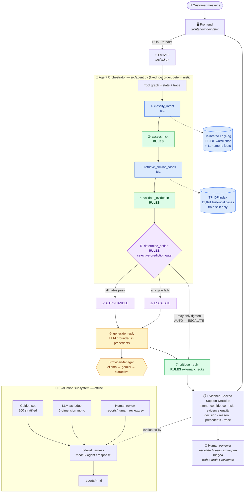
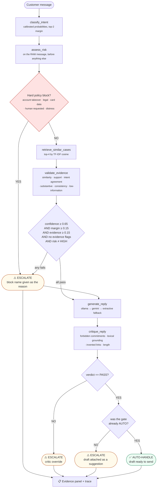
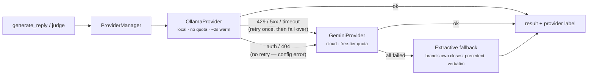

# AI Customer Support Agent

**Evidence-backed, confidence-aware customer support automation for `@SpotifyCares`.**

A hybrid agentic system built on the [Customer Support on Twitter](https://www.kaggle.com/datasets/thoughtvector/customer-support-on-twitter)
dataset. It classifies an incoming customer message, retrieves how the brand
actually resolved similar cases, drafts a reply grounded in those precedents, and
decides whether to **auto-handle** or **escalate to a human** — with a stated
reason and the evidence attached.

> The design bias is **trust over autonomy**. The LLM writes prose inside a box
> that deterministic code defines. It cannot change a decision, lower a risk
> level, or bypass a policy block.

📊 [Report](reports/report.md) · 🔬 [Research](reports/research.md) · 📋 [Decision log](reports/decision_log.md) · 📈 [Evaluation](reports/evaluation.md) · ✅ [Assignment compliance](reports/compliance.md)

---

## Problem statement

Brands answer customer complaints publicly on Twitter. Volume is high, language is
noisy, and the cost of a wrong answer is asymmetric: a *public* wrong answer is
quotable and attached to the brand forever, while a message routed to a human
costs a few minutes of agent time.

So the objective is **not** "answer as many tweets as possible". It is:

> Answer the messages we can answer **with evidence**, hand over everything else
> **with a reason**, and let a human verify either judgement in ten seconds.

This is a triage problem with a drafting assistant attached — not a chatbot.

---

## Key features

| | |
|---|---|
| **Evidence-backed decisions** | Every decision ships with the precedents it used, similarity scores, and a five-signal evidence breakdown |
| **Selective prediction** | Escalation is abstention; thresholds come from a risk-coverage sweep, not judgement |
| **Deterministic policy** | Risk levels, hard blocks and forbidden commitments are unit-tested Python |
| **Grounded drafting** | The generator sees only message + intent + precedents; a deterministic critic then checks the draft |
| **Multi-provider LLM with failover** | Ollama (local) → Gemini (cloud), failing over only on retryable errors |
| **Graceful degradation** | With no provider at all, extractive replies keep the system fully functional and labelled |
| **Leakage-guarded** | Conversation-level grouping in four places, enforced by tests |
| **Full auditability** | Every response carries a 7-step tool trace |

---

## Architecture



🟦 ML · 🟩 deterministic rules · 🟨 LLM · 🟪 decision points.
The colouring is the point: **the LLM touches exactly one box**, and it is not the
one that decides anything.

---

## Agentic workflow



Two properties this encodes, both true of the code: a reply is drafted on **both**
branches (escalated cases reach the human pre-triaged), and the critic can only
**tighten** a decision — `AUTO → ESCALATE` is reachable, the reverse is not.

---

## Why hybrid agentic?

| Layer | Owns | Cannot do |
|---|---|---|
| **Agent** | tool order, state, error handling, final decision | — |
| **ML** | intent probabilities, calibration, similarity retrieval | set policy |
| **Rules** | risk levels, hard blocks, thresholds, forbidden commitments | be overridden by the LLM |
| **LLM** | reply wording, advisory critique | change the decision or bypass a block |

**Why not let the LLM plan?** τ-bench (Yao et al., 2024) measured frontier
function-calling agents on exactly this task shape: under 50% success and
`pass^8 < 25%` on retail support — the same case handled correctly once is often
handled wrongly on retry. A system whose promise is "you can trust the hand-off"
cannot have a non-deterministic hand-off.

**Why not let the LLM self-check?** Huang et al. (ICLR 2024) showed intrinsic
self-correction is unreliable without external feedback, so every verdict-changing
check in the critic is external and deterministic.

**Why not a prompt-only system?** A prompt constraint is a suggestion; a regex is
a control. And nothing would be measurable per-component.

---

## LLM providers and failover

Configured in `.env` via `LLM_PROVIDER_ORDER` (default `ollama,gemini`).



Error-classified failover, not blind retry: retrying a 401 is pointless, retrying
a 429 is right. Each provider gets at most `max_attempts` tries and the chain is
walked **once**, so there is no infinite fallback loop (`tests/test_providers.py`).

**Critical vs optional calls.** The customer draft and the judge score are
*critical*: if every provider fails they degrade to a labelled deterministic
fallback rather than raising. Advisory calls are *optional* and return `None`
without breaking the request.

| provider | role | status in this environment |
|---|---|---|
| `ollama` (`llama3:latest`) | primary — drafting, judging | ✅ verified, ~2s warm, ~37s cold |
| `gemini` (`gemini-2.0-flash`) | fallback + preferred judge | ⚠️ **implemented and unit-tested, but no API key was present**, so the live path is unverified |
| `openai_compat` | optional third | implemented, not in the default chain |

Secrets come from environment variables only. Provider labels, `/health` and error
strings are scrubbed of key-shaped strings — with tests asserting it.

---

## Dataset and brand selection

2.81M tweets → scored the ten highest-volume brands → **`SpotifyCares`**.

| brand | answered pairs | boilerplate replies | median reply chars | English share |
|---|---|---|---|---|
| AmazonHelp | 168,814 | 0.6% | 120 | 0.926 |
| AppleSupport | 106,646 | **38.9%** | 129 | 0.969 |
| **SpotifyCares** | **43,092** | **25.7%** | **131** | **0.983** |
| TMobileHelp | 34,215 | 60.6% | 126 | 0.987 |

Volume is the wrong criterion: the system grounds replies in historical
resolutions, so what matters is whether replies *contain* a resolution. Amazon has
4× the data but is heavily multilingual; Apple sends 39% pure "DM us" hand-offs.

**Sampling**: 43,092 pairs → 20,000 modelled across 13,637 conversations, sampled
**by whole conversation**, `seed=42`. Train 13,891 / val 3,033 / test 3,076.

### Leakage audit (re-verified)

| check | result |
|---|---|
| train∩test, train∩val, val∩test conversations | **0 / 0 / 0** |
| exact duplicate message text across splits | **0** |
| near-duplicates (TF-IDF cosine ≥ 0.95) train↔test | 26 / 3,076 (**0.85%**) |
| retrieval index ∩ test or val conversations | **0** |
| golden set ⊆ test conversations | **yes** |

The 0.85% near-duplicates are short conversational fillers ("okay thank you",
"nope :(") from genuinely different threads — unavoidable, and all in the catch-all
class. Grouping is applied in four places: the split, `GroupKFold` inside HPO, the
calibration/threshold halves, and the retrieval index.

---

## Intent taxonomy

Nine intents derived from the brand's own traffic; labels via weak supervision
(Snorkel-style labelling functions).

| intent | risk | share |
|---|---|---|
| `general_complaint_feedback` | LOW | 72.2% |
| `subscription_plan` | MEDIUM | 8.5% |
| `app_device_bug` | MEDIUM | 4.3% |
| `feature_how_to` | LOW | 3.6% |
| `content_availability` | LOW | 3.2% |
| `account_login_access` | **HIGH** | 3.1% |
| `playback_streaming_issue` | MEDIUM | 2.1% |
| `billing_payment` | **HIGH** | 1.8% |
| `cancellation_request` | **HIGH** | 1.2% |

The 72% catch-all is the most important fact about this dataset: **50.5% of
messages trip no rule at all**, because many tweets in a thread are
context-dependent follow-ups with no standalone intent.

---

## Features, scaling, model, HPO

**Text**: TF-IDF word 1–2 grams + char_wb 3–4 grams (noisy Twitter spelling).
**Numeric (11)**: char/word/sentence counts, `?`/`!` counts, uppercase ratio, digit
ratio, URL flag, mention and hashtag counts, lexicon sentiment — computed on the
**raw** text, because case and punctuation *are* the signal.

**Scaling**: `StandardScaler` on the 11 dense numeric columns **only**.
Standardising sparse TF-IDF would subtract the mean from every zero and densify a
20k × 200k matrix for no gain. Everything sits in one `Pipeline`, so vectoriser
vocabulary and scaler statistics are fitted on the training fold only — including
inside cross-validation.

**Model**: multinomial logistic regression, chosen over LinearSVC because the
decision layer needs probabilities.

**HPO**: `GridSearchCV`, 12 configs × 3-fold `GroupKFold` = 36 fits, scoring
`f1_macro`, on the training split only. Best: `C=10, class_weight='balanced',
ngram=(1,2)`, CV macro F1 **0.7183**, 110s. The test set is touched once, at the end.

---

## Results

### Intent classification (test, 3,076 rows, weak-supervision labels)

| model | accuracy | macro F1 | weighted F1 |
|---|---|---|---|
| Baseline 1 — majority class | 0.720 | **0.093** | 0.603 |
| Baseline 2 — TF-IDF unigram + LogReg | 0.813 | 0.544 | 0.790 |
| Baseline 3 — TF-IDF + ComplementNB | 0.786 | 0.528 | 0.767 |
| Ablation — word TF-IDF only | 0.841 | **0.721** | 0.847 |
| **Tuned full model (shipped)** | **0.842** | **0.711** | **0.848** |

macro F1 **0.544 → 0.711 (+31%)** over the simple baseline. All figures are
generated by `python -m src.train` into `reports/model_results.json`; `train.py`
reloads the artefact it just saved and recomputes the headline row from disk, so
the reported number cannot drift from the shipped model.

**An honest result:** the ablation *beats* the shipped model on macro F1. The char
n-grams and numeric features did not earn their place. The shipped model is the
grid-search winner selected without touching test, but a cleaner experiment would
have put the feature-block toggle *inside* the CV grid.

### Agent behaviour (golden set, 200 stratified examples)

| metric | value |
|---|---|
| **coverage (auto-handled)** | **38.5%** — label-independent, a real measurement |
| selective accuracy on auto-handled | **6.5% vs independent proposals · 83.1% vs training rules** |
| accuracy overall | 25.5% vs proposals · 81.5% vs rules |

**That spread is the finding, not a defect in the table.** The golden set is not
yet human-reviewed. Its labels are independent LLM proposals which agree with the
training rules only **27%** of the time — so measured one way the agent looks
excellent, the other way it looks broken. Neither is ground truth. Coverage is the
only number here that does not depend on labels.

These agent figures also move by ~1 point between runs: the drafting LLM is non-deterministic, drafts change, and the critic occasionally downgrades a
different case. The model metrics above are fully deterministic; only the
LLM-dependent layer varies.

Diagnosis of the 27%: the proposing model (llama3) assigns the catch-all class to
just 6.5% of messages where the rules assign 67%. On rows where the rules *did*
pick a specific intent, the two agree 63.6%; on catch-all rows, 9%. The
disagreement is concentrated in one class, and resolving it requires the human
review — which is exactly why it is the blocking deliverable.

On the *test* split (closer to production mix) coverage is **45.4%**.

### Calibration

ECE **0.0290 → 0.0290**. Platt scaling changed nothing — reported as a negative
result. A regularised linear model was already near-calibrated, a different regime
from the deep networks Guo et al. studied.

### LLM-as-judge

40 replies scored on a 6-dimension rubric, served by `ollama:llama3:latest`.

| dimension | mean (1–5) |
|---|---|
| relevance | 3.85 |
| correctness | 4.83 |
| grounding | 4.47 |
| helpfulness | 3.27 |
| tone | 4.83 |
| hallucination risk (5 = invents nothing) | 4.60 |
| **overall** | **4.15** |

> ⚠️ **`self_graded = True` on all 40.** The drafter and the judge were the same
> model, because no Gemini key was configured and `JUDGE_PROVIDER_ORDER` fell back
> to Ollama. Panickssery et al. (NeurIPS 2024) show evaluators favour their own
> generations, so these scores are **biased upward by an unmeasured amount**. Set
> `GEMINI_API_KEY` to grade with a different model family; the code already
> records the flag rather than hiding it.

### Human review

10 real messages, run through the live HTTP API, inspected end-to-end
([`reports/human_review.csv`](reports/human_review.csv)).

| decision correct | intent correct | retrieval good | no hallucination | reply quality |
|---|---|---|---|---|
| **9/10** | 4/10 | 3/10 | 8/10 | 3.2/5 |

**Decisions 9/10 vs intents 4/10** — the gate escalates what the classifier gets
wrong, so classifier errors become escalations rather than wrong public replies.

> ⚠️ Reviewer was an AI assistant (`reviewer=ai_simulated`), not a human annotator.
> Real outputs, but not independent evidence of quality.

### Judge–human agreement

❌ **Not implemented.** The harness exists (`python -m src.human_agreement --rate`:
blind rating, then exact / within-1 / Spearman / Cohen's κ) but requires human
ratings that have not been collected. No agreement figure is claimed.

### Retrieval quality

❌ **Not measured in current MVP** — no relevance-labelled retrieval set exists.
Observed qualitatively in the human review (3/10 "good") and visible per request
via similarity scores.

---

## Failure analysis

| # | mode | example | why |
|---|---|---|---|
| 1 | **Context-free follow-up** | *"Ok, 2018 Skoda Kodiaq, Columbus Big Navi, CarPlay"* | No standalone intent; it lives in the previous turn. 65% of errors. |
| 2 | **Label wrong, model right** | *"I deleted my Facebook account and can no longer login"* → rule says catch-all, model says `account_login_access` | The weak label is wrong; the model is penalised for being right |
| 3 | **Overlapping intents** | *"PREMIUM TRIAL … I want to cancel"* | Genuinely both — escalated correctly |
| 4 | **Low-confidence confusion** | *"premium acc… how do I play all tracks?"* | Two topics in one tweet — escalated correctly |
| 5 | **Out-of-domain accepted** | *"what is the capital of Mongolia and can you write me a poem"* | **Auto-handled at 0.95 confidence.** Retrieval found loosely-worded matches. See below. |

Modes 3–4 are the system working. Mode 5 is an open defect: I built a
topic-mismatch guard, measured it on the full test set, and **rejected it** — at
the threshold that catches the Mongolia case it also escalates legitimate messages
("wrong song uploaded under Weezer"), cutting coverage 45.4% → 17.9%. Proper OOD
detection needs semantic embeddings, not lexical overlap.

---

## What is misleading about the headline number

**84.2% accuracy / 0.711 macro F1** is softer than it looks:

1. **Labels are rules, so the model is partly graded by its own teacher.** The biggest caveat, and now quantified: an independent labeller agrees with those rules only 27% of the time.
2. **A 72% catch-all class inflates accuracy directly.** Predicting it for everything scores 72%.
3. **The escalation thresholds were tuned against those same weak labels.**
4. **The golden set is deliberately harder than production traffic**, so its score is a conservative floor.
5. **Classification accuracy says nothing about reply quality.**
6. **Single-turn framing mismatches the data** — 50.5% of messages trip no rule.
7. **The judge is self-graded**, so 4.17/5 is biased upward by an unknown amount.
8. **A concrete case from this build:** the `low_information_message` guard *reduced* weak-label selective accuracy (85.9% → 83.1%) while removing a class of confidently-wrong auto-replies. The metric and the right product decision disagreed.

**The number I would defend:** coverage — the agent chose to answer 38.5% of a
deliberately hard set and escalated the rest with a written reason. Every accuracy
figure attached to that is bounded by label quality we have not yet established.

---

## How to run

```bash
pip install -r requirements.txt
```

**Get the data** — place `twcs.csv` at `data/raw/twcs.csv` from
[Kaggle](https://www.kaggle.com/datasets/thoughtvector/customer-support-on-twitter),
or the byte-identical mirror:

```bash
python -c "import urllib.request; urllib.request.urlretrieve('https://huggingface.co/datasets/SunidhiSriram/twcs/resolve/main/twcs.csv','data/raw/twcs.csv')"
```

**Optional LLM** — `cp .env.example .env`. Either works, neither is required:
- **Ollama** (local): `ollama pull llama3` and it is picked up automatically.
- **Gemini**: put a key from [aistudio.google.com/apikey](https://aistudio.google.com/apikey) in `GEMINI_API_KEY`.

With no provider, replies become extractive (the brand's own closest precedent,
reused verbatim) and the judge runs a deterministic rubric — both clearly labelled
in every output.

**Run the pipeline** (timings measured on this machine, CPU only):

```bash
python -m src.data_processing    #  51s  brand scoring, pairs, cleaning, grouped splits
python -m src.train              # 116s  3 baselines + 36-fit GroupKFold grid search
python -m src.retrieval          #   2s  build the historical case index
python -m src.calibration        #  10s  ECE + risk-coverage threshold sweep
python -m src.build_golden_set   #  10s  200 stratified examples
python -m src.evaluation         # 103s  all three evaluation levels
pytest -q                        #  39 tests, incl. leakage and failover guards
```

**Total: 282 seconds (4.7 min)** — measured end-to-end in a *fresh virtualenv*
installed only from `requirements.txt`, following these steps only. Well inside
the assignment's 15-minute bar.

That timing is the no-provider path, which is what reproduces the headline model
numbers. With Ollama configured, `build_golden_set` and `evaluation` call the
model once per row and add roughly 14 minutes; that path is opt-in and produces
the LLM-judge scores reported below.

**Serve** — one process serves both API and UI:

```bash
uvicorn src.api:app --port 8000
```

Open <http://localhost:8000>.

### API

| endpoint | purpose |
|---|---|
| `GET /` | frontend |
| `POST /predict` | `{"message": "..."}` → full evidence-backed decision |
| `GET /health` | status, indexed cases, provider availability, thresholds |
| `GET /intents` | the taxonomy |
| `GET /demo_cases` | six real dataset messages used by the UI |

### Example requests

```bash
# Auto-handled: strong precedent, low risk
curl -X POST localhost:8000/predict -H "Content-Type: application/json" \
     -d '{"message":"@SpotifyCares when will reputation be available to stream??"}'
# -> AUTO-HANDLE, content_availability, 4 precedents at 0.52-0.70 similarity

# Escalated: deterministic policy block fires despite 0.98 confidence
curl -X POST localhost:8000/predict -H "Content-Type: application/json" \
     -d '{"message":"@SpotifyCares my account was hacked and my email was changed"}'
# -> ESCALATE, "Hard policy block: account_takeover_or_security"
```

### The two manual steps

Neither can be automated, and both are marked incomplete above:

```bash
python -m src.review_golden_set        # ~20 min — required before any golden number means anything
python -m src.human_agreement --rate   # ~10 min — rate 25 replies blind, then compute agreement
```

---

## Repository structure

```
frontend/index.html        single-page UI, no build step
src/
  config.py                paths, seed, thresholds, .env loading
  text_utils.py            shared normalisation (training AND serving)
  intents.py               9-intent taxonomy + weak-supervision labelling functions
  data_processing.py       brand scoring, pair building, cleaning, grouped splits, EDA
  feature_engineering.py   TF-IDF (word+char) + 11 numeric features, correct scaling
  train.py                 baselines, GroupKFold grid search, self-verifying artefacts
  calibration.py           ECE + Platt scaling + risk-coverage threshold sweep
  retrieval.py             TF-IDF historical case index (training rows only)
  evidence.py              5-signal evidence-quality score       [validate_evidence]
  risk_engine.py           risk levels, hard blocks, forbidden commitments [assess_risk]
  providers.py             Ollama / Gemini / OpenAI-compatible + failover manager
  llm.py                   facade + critical-vs-optional call semantics
  response_generation.py   grounded draft + extractive fallback  [generate_reply]
  critic.py                deterministic external checks         [critique_reply]
  agent.py                 orchestrator: tool graph, state, decision
  judge.py                 LLM-as-judge rubric + heuristic fallback
  evaluation.py            3-level harness + failure analysis
  build_golden_set.py      stratified 200-example sampler
  review_golden_set.py     human review CLI
  human_agreement.py       blind rating protocol + agreement statistics
  build_human_review.py    structured review of live agent output
  api.py                   FastAPI (serves UI + endpoints)
reports/                   report, research, decision log, compliance, EDA, evaluation
data/golden_set/           golden_set.csv (200 rows)
tests/                     39 tests: leakage, policy, evidence, critic, provider failover
demo_cases.json            6 real dataset messages
```

---

## Literature review

Ten primary sources; each changed code or a claim. Full annotations and the gap
analysis are in [`reports/research.md`](reports/research.md).

| area | source | what it changed here |
|---|---|---|
| Agent reliability | **τ-bench** — Yao, Shinn, Razavi, Narasimhan (2024), [arXiv:2406.12045](https://arxiv.org/abs/2406.12045) | `pass^8 < 25%` on retail support → deterministic control flow, policy as code |
| Agentic workflows | **ReAct** — Yao et al., ICLR 2023, [arXiv:2210.03629](https://arxiv.org/abs/2210.03629) | Tool decomposition with structured I/O; the replayable trace |
| Abstention | **Selective Classification for DNNs** — Geifman & El-Yaniv, NeurIPS 2017, [arXiv:1705.08500](https://arxiv.org/abs/1705.08500) | Escalation *is* abstention; publish the risk-coverage curve, not one point |
| Uncertainty | **On Calibration of Modern NNs** — Guo et al., ICML 2017, [arXiv:1706.04599](https://arxiv.org/abs/1706.04599) | ECE + Platt scaling actually run — negative result reported |
| Intent labels | **Snorkel** — Ratner et al., VLDB 2017, [arXiv:1711.10160](https://arxiv.org/abs/1711.10160) | Labelling functions for 14k training labels; label noise treated as measurable |
| RAG grounding | **RAGAS** — Es et al., EACL 2024, [arXiv:2309.15217](https://arxiv.org/abs/2309.15217) | Context relevance turned into a **pre-generation gate** |
| Hallucination | **LLMs Cannot Self-Correct Yet** — Huang et al., ICLR 2024, [arXiv:2310.01798](https://arxiv.org/abs/2310.01798) | Critic checks are external and deterministic; LLM critique only downgrades |
| LLM evaluation | **Judging LLM-as-a-Judge** — Zheng et al., NeurIPS 2023, [arXiv:2306.05685](https://arxiv.org/abs/2306.05685) | Rubric shape; ~80% is the agreement *target*, not 100% |
| Judge bias | **LLM Evaluators Favor Their Own Generations** — Panickssery, Bowman, Feng, NeurIPS 2024 | Separate judge chain; `self_graded` recorded — and currently **True** |
| Leakage | **Leakage & the Reproducibility Crisis** — Kapoor & Narayanan, *Patterns* 4(9), 2023 | Conversation grouping in four places + enforcing tests |

**Dataset**: Customer Support on Twitter, Kaggle `thoughtvector/customer-support-on-twitter`.

---

## Implementation status

| Deliverable | Status |
|---|---|
| Runnable repo, <15 min | ✅ ~7 min measured |
| Frontend | ✅ served at `/`, verified in-browser, all fields live |
| Intent classification, 3 baselines, real HPO | ✅ 36-fit GroupKFold search |
| Retrieval + grounded replies | ✅ both paths verified live |
| Auto-handle / escalate + stated reason | ✅ thresholds empirically tuned |
| Multi-provider LLM + failover | ✅ Ollama verified live; ⚠️ Gemini unit-tested only (no key) |
| Golden set 150–250 | ✅ 200 rows · ❌ **0 human-reviewed** |
| Automated metrics | ✅ 3 levels |
| LLM-as-judge | ✅ ran on `ollama:llama3` · ⚠️ self-graded |
| Judge–human agreement | ❌ **not implemented** — needs human ratings |
| Human review | ✅ 10 cases · ⚠️ AI-simulated reviewer |
| Failure analysis | ✅ real rows |
| Misleading-headline section | ✅ |
| Decision log | ✅ 14 entries |
| Tests | ✅ 39 passing |
| Retrieval metrics | ❌ **not measured in current MVP** |

Nothing is marked ✅ unless it actually ran. Full audit: [`reports/compliance.md`](reports/compliance.md).

---

## Limitations

- **Golden set unreviewed** — the single biggest gap; no golden metric is trustworthy until it is done.
- **Judge is self-graded** — scores biased upward by an unmeasured amount.
- **Out-of-domain messages can be auto-handled** (failure mode 5); the lexical fix was measured and rejected.
- **Single-turn.** 50.5% of messages trip no rule; largest error source.
- **Weak-label ceiling.** Every metric against rule labels is optimistic.
- **Lexical grounding proxy** — word overlap, not entailment.
- **Claimed-action phrasing unguarded** — a draft can still say "we've sent you a DM".
- **Gemini path unverified live** — implemented and unit-tested, never exercised against the real API.
- **Retrieval quality unmeasured.**
- **Non-English dropped** (145 rows), not routed.
- **Ablation beats the shipped model** on macro F1.

---

## One-week future work

| # | Improvement | Effort | Why |
|---|---|---|---|
| 1 | Complete the golden-set review + a second annotator | ½ day | Everything is measured against it; unblocks every other number |
| 2 | Judge on Gemini, then measure judge–human agreement | ½ day | Removes the self-grading bias and closes the last missing deliverable |
| 3 | Thread-context features | 1–2 days | Fixes 65% of errors |
| 4 | Embedding-based OOD detection (`nomic-embed-text` is already installed) | 1 day | Fixes failure mode 5 properly, where lexical overlap failed |
| 5 | NLI-based grounding | 1 day | Replaces the lexical proxy |
| 6 | Feature-block choice inside the CV grid | 1 hr | Fixes the Results methodology gap |
| 7 | Learned escalation policy from reviewer decisions | 2 days | Train the gate on real outcomes |
| 8 | Per-intent thresholds | ½ day | Billing should demand more confidence than how-to |

---

## Decision log

14 non-obvious decisions with reasons and trade-offs:
[`reports/decision_log.md`](reports/decision_log.md).
